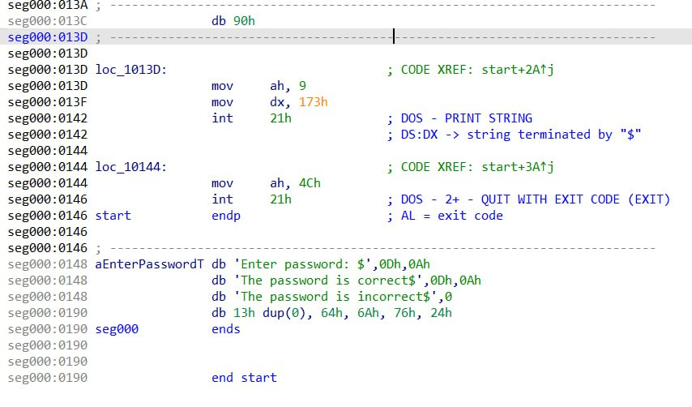

# Ход взлома 
    1) с помощью дизассемблера IDA просмотрел раздел программы, где храняться данные

    2) выяснил, что можно переполнить буффер ввода и 
    записать желаемый пароль длиной в 3 символа 

    3) выяснил, что сравнение пароля с эталонным 
    происходит посимвольно след. образом: 
        Младшие 4 бита каждого символа 
    с помощью операции
    XOR и маски 00001111 инвертируются
    и сравниваются с эталлонным паролем, 
    лежащем в памяти

    4) написал программу, которая, по описанному выше принципу,
    инвертирует символы желаемого для ввода 3-ёх символьного пароля 

    5) переполнил буффер ввода по след. принципу:
        3 + '$' + 16 + 3
        |              |
      пароль     инвертир. пароль

    размер буфера = 20 расчитан из разности адресов 
    начала буфера и начала строки пароля = ( 1A3 - 18F )

# Patcher 

###    1) Запуск
    надо прописать команды:
    1. make
    2. ./keygen 

###    2) Обьяснение 

    1. Сперва происходит агрузка файла CRACKME.com для взлома из папки src и создаётся его копия 

    2. Далее запускается графическое окно, сделанное с помощью SFML

    3. Когда прогресс-бар в окне доходит до конца, 
    запускается функция patcher(), которая переписывает один байт на позиции 44-ого байта от начала файла    (рис. 1).
    
    Изменяемый байт представляет из себя относительный адрес для Jump'a. 
    Таким образом Jump передаёт управление функции, 
    которая сообщает, что пароль верный.
    (рис. 2)

       