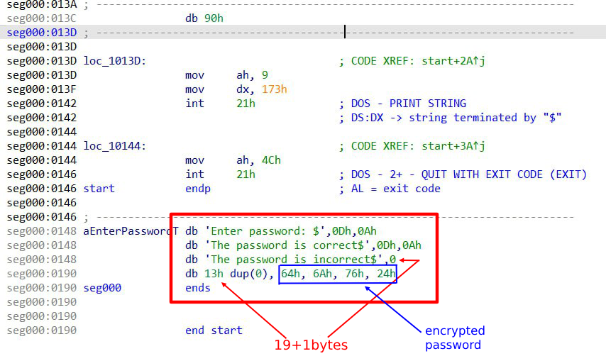
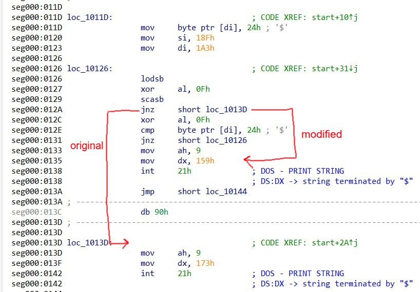

# Задача
1.  Я получил файл CRACKME.com от моего напарника, программа 
    представляет из простой, на первый взгляд, опросник. 
    Эта программа спрашивает у пользователя пароль, в случае, 
    если он совпадает с заложенным в программу, выводит надпись
    'Success!', в случае неправильного: 'Password is incorrect'.
2. Первое задание: Найти в программе 2 уязвимости:  
    * Первая, связанная с переполнением буффера для пароля, т.к. не проверяется его длина
    * Вторая может быть любой, зависит от фантазии автора и желания усложнить работу напарнику
    
    Второе задание: Написать программу - патчер на языке высокого уровня в функционал которого входит: 
    * Открытие файла с программой CRACME.com и выполнение бинарной вставки ( изменение небольшого числа байтов оригинала файла программы с целью изменения поведения программы ) 
    * Создание и демонстрация графического окна, созданного графической библиотекой ( SFML, TXLib ), c информацией о том, что файл был взломан и любыми дополнительными графическими фантазиями автора 

# Ход взлома 
0) Скачал программу - дизассемблер IDA для реинжини́ринга взламываемой программы, разобрался с базовым функционалом
1) C помощью дизассемблера IDA просмотрел раздел программы, где храняться данные

2) Я выяснил, что можно переполнить буффер ввода и 
    записать желаемый пароль длиной в 3 символа 

3) Я выяснил, что сравнение пароля с эталонным 
    происходит посимвольно след. образом: 

    + Младшие 4 бита каждого символа 
    с помощью операции
    XOR и маски 00001111 инвертируются
    и сравниваются с эталлонным паролем, 
    лежащем в памяти 

4) Я написал программу, которая, по описанному выше принципу,
    инвертирует символы желаемого для ввода 3-ёх символьного пароля 

5) Я переполнил буффер ввода по след. принципу:
        3 + '$' + 16 + 3
        |              |
      пароль     инвертир. пароль

    + размер буфера = 20, расчитан из разности адресов начала буфера и 

        начала строки пароля = ( 1A3 - 18F ), ( адреса не из DOSBox, а из IDA )

# Patcher 

###    1) Запуск
    надо прописать команды:
    1. make
    2. ./keygen 

###    2) Как это работает ?  

    1. Сперва происходит загрузка файла CRACKME.com для взлома из папки src и создаётся его копия 

    2. Далее запускается графическое окно, сделанное с помощью SFML

    3. Когда прогресс-бар в окне доходит до конца, 
    запускается функция patcher(), которая переписывает один байт на позиции 44-ого байта от начала файла

    Изменяемый байт представляет из себя относительный адрес для Jump'a. 
    Таким образом Jump передаёт управление функции, 
    которая сообщает, что пароль верный.

       